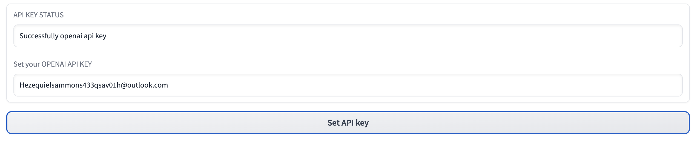
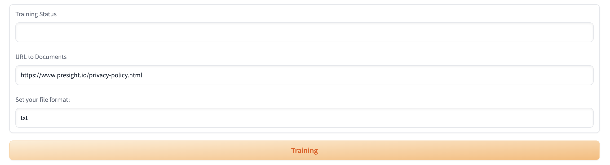
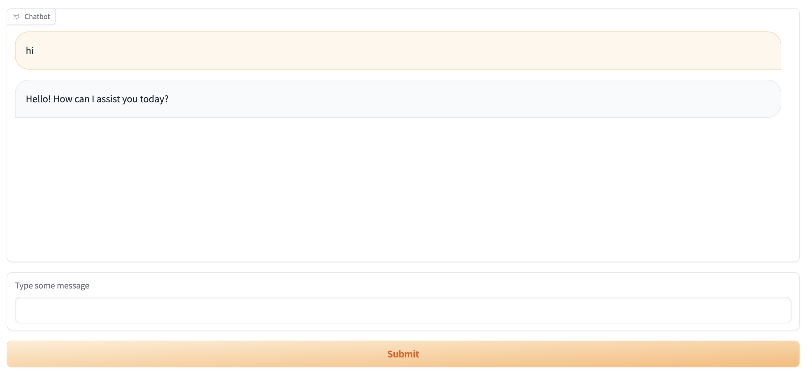
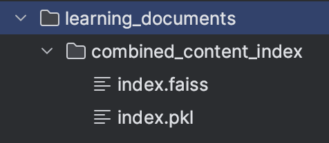

# Own-Knowledge-GPT 
## Introduction 
Welcome to the Own-Knowledge-GPT, this is a demo project that allow you want your Chat bot can learn anything you want 

This project is built by Python and integration with OpenAI API which use GPT-3.5-turbo model 

## Getting Started 
### 1. Environment Setup
The project is built in python 3.9+. You need to install python 3.9 or later
```commandline
  git clone git@hf.co:spaces/myn0908/Own-Knowledge-GPT
```
For install dependencies:
```commandline
 pip install -r requirements.txt
```
### How to use 
This project use Gradio to build User Interface, please use: 
```commandline
 python app.py
```
Enjoy project with step by step follow this: 
First step, you need to set your openai api key right here:
!
Bot Learning with URL 
!

Please input URL and your file format and then press Training button, when the training process is finished, it's will notice you Training Completed 

After that, you can starting chat with your custom bot about the topic in your URL
!

The vector index storage by this structure: 

!

I've already adding the data from this page: https://www.presight.io/privacy-policy.html
You can check and chat with bot for Information in that or You can training more knowledge for it